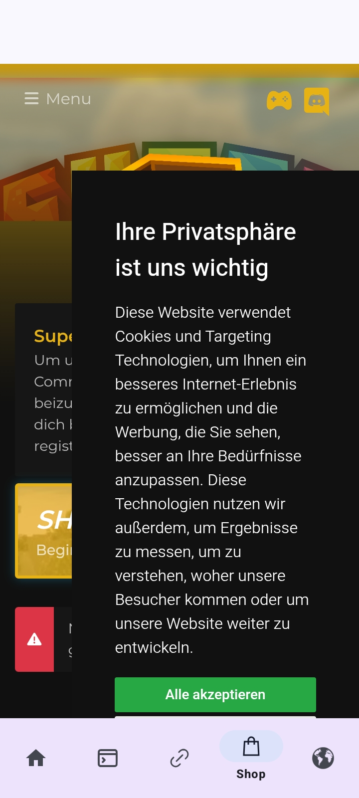
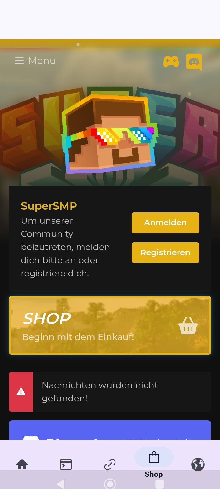
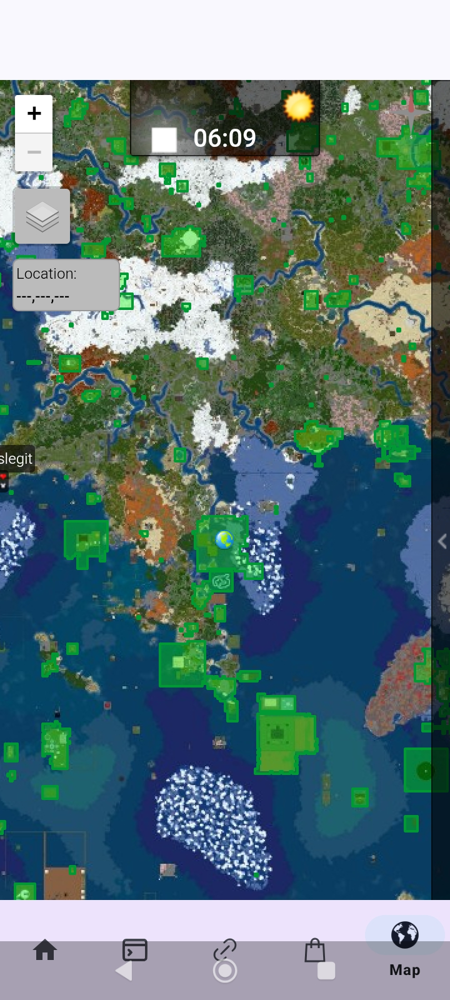

# SuperSMP Companion App

<h1>Release numbers</h1>

<h1>📸 Pictures of SuperSMP Companion in Action</h1>

<h1>Repository, Build and App Information</h1>

**The ultimate unofficial companion app for the SuperSMP Minecraft Server**

## 📱 About

The SuperSMP Companion App is a free, open-source Android application designed to enhance your SuperSMP Minecraft Server experience. Access key server features directly from your mobile device with a modern, intuitive interface built with Jetpack Compose.

> **⚠️ Disclaimer:** This companion app is unofficial and not affiliated with or endorsed by the SuperSMP Minecraft Server.

## ✨ Features

### 🗳️ **In-App Voting**
- Vote for the server directly from your phone
- Quick access to voting platforms
- Track your voting history

### 🛒 **Integrated Shop**
- Browse the official SuperSMP shop
- View items and pricing
- Make purchases on-the-go

### 🗺️ **Interactive Map**
- Access the official SuperSMP map
- Real-time server overview
- Navigate spawn and key locations

### 🎨 **Modern UI**
- Built with Jetpack Compose for smooth animations
- Material Design 3 interface
- Dark/Light theme support
- Optimized for all screen sizes

### 🔧 **Technical Features**
- **Kotlin-first** development approach
- **Jetpack Compose** for modern UI
- **Kotlin DSL** for build configuration
- Minimum Android 7.0 (API 24) support
- Targeting Android 15 (API 36)

## 📥 Download & Installation

### Get the Latest Version

You can download the latest version of SuperSMP Companion App from the following platforms:

- **GitHub Releases**: [Direct Download](https://github.com/FreetimeMaker/GeoWeather/releases/latest)
- **F-Droid**: [com.freetime.ssmpc](https://f-droid.org/packages/com.freetime.geoweather)
- **Obtainium**: [Automatic Updates](https://apps.obtainium.imranr.dev/redirect?r=obtainium://app/%7B%22id%22%3A%22com.freetime.geoweather%22%2C%22url%22%3A%22https%3A%2F%2Fgithub.com%2FFreetimeMaker%2FGeoWeather%22%2C%22author%22%3A%22Freetime%20Maker%22%2C%22name%22%3A%22GeoWeather%22%2C%22additionalSettings%22%3A%22%7B%5C%22includePrereleases%5C%22%3Afalse%7D%22%7D)
- **GitHub Store**: [Open in GitHub Store](https://github-store.org/app?repo=FreetimeMaker/SuperSMP-Companion-App)

## 🚀 Upcoming Features

Planned:
- [ ] **Screenshot & Video Gallery** - Showcase app functionality
- [ ] **Multi-language Support** - Internationalization

## 📄 License

This project is licensed under the [Apache-2.0 License](LICENSE).

## ❤️ Support This Project

SuperSMP Companion App is 100% free. No ads. No tracking.

- ⭐ **[Star](https://github.com/FreetimeMaker/GeoWeather/star)** this repository
- 🐛 **[Report](https://github.com/FreetimeMaker/GeoWeather/issues)** bugs and issues
- 💡 **[Suggest](https://github.com/FreetimeMaker/GeoWeather/discussions)** new features
- 💳 **[Sponsor](#-donations)** the developer

---

## 🤝 Contributing

Contributions are welcome! Feel free to open issues or submit pull requests.

### Contributors :handshake:

## 🌟 Star History

<a href="https://www.star-history.com/#FreetimeMaker/SuperSMP-Companion-App&type=date&legend=top-left">
 <picture>
   <source media="(prefers-color-scheme: dark)" srcset="https://api.star-history.com/svg?repos=FreetimeMaker/SuperSMP-Companion-App&type=date&theme=dark&legend=top-left" />
   <source media="(prefers-color-scheme: light)" srcset="https://api.star-history.com/svg?repos=FreetimeMaker/SuperSMP-Companion-App&type=date&legend=top-left" />
   
 </picture>
</a>

---

## 🤝 Donations

If you like SuperSMP Companion App, I'd appreciate a small donation — thank you! Below are some common cryptocurrency options.

Alternatively, you can also display the addresses directly:

- Bitcoin (BTC): `1DsCAVrzvGokrzXpe6YR33QuTo5EppiKRE` — or open in block explorer by clicking the badge above
- Litecoin (LTC): `LU2ERRXKTeKnzpuieQcpsBteViEY7ff5Wg` — or open in block explorer by clicking the badge above

<i>Developed with ❤️ by FreetimeMaker</i>

